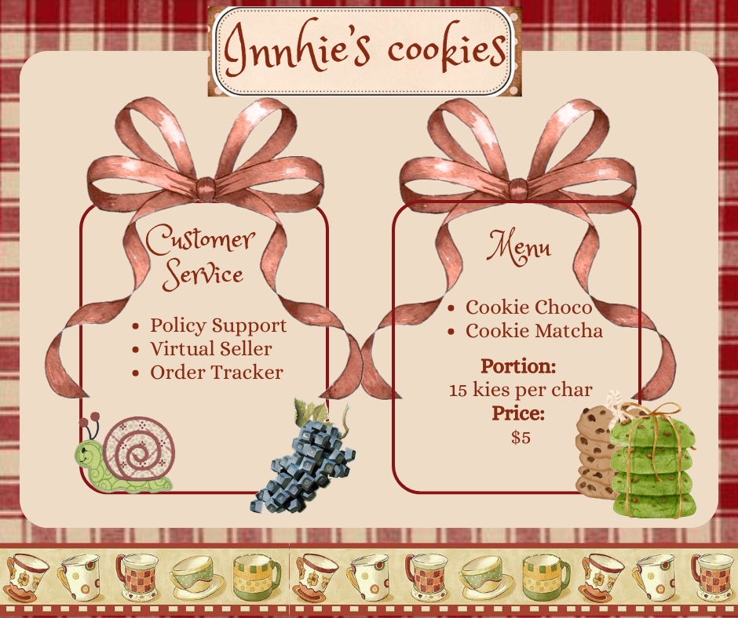
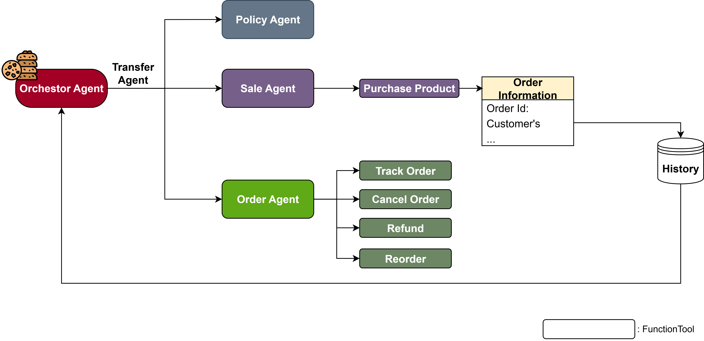

# Innhie's cookie store
This is my very first project experimenting with agents, where I imagine myself as the seller of homemade cookies 🍪. The idea is simple: instead of answering every customer one by one, I let the agents handle customer service automatically. That way, even if many people ask about policies, how to place an order, or need some menu consultation at the same time, no one has to wait too long for a reply.

## ✪ Multi-Agent Customer Service
The customer service includes three subagents:
1. **policyAgent**  
   Think of this as the *policy manager*. It helps customers quickly understand the store rules:  
   - The condition when places orders. For example: pre-order time,...
   - Explaining cancellation conditions  
   - Clarifying refund policies  
   - Making sure customers know what counts as a successful order  

2. **saleAgent**  
   The one that talks like a real seller. It introduces cookies, records customer info, and handles the first step of purchasing.  
   - **ToolContext:** `purchaseProduct`  

3. **orderAgent**  
   Once an order is placed, this agent takes over. It manages the entire order history and can:  
   - Track current order status and delivery  
   - Cancel an order  
   - Handle refund checks  
   - Assist with reorders based on previous purchases  
   - **ToolContext:** `trackingOrder`, `cancelOrder`, `refund`, `reorder`

## 🧩 Operation
- With each subagent, I instructed them following the main mission
  

